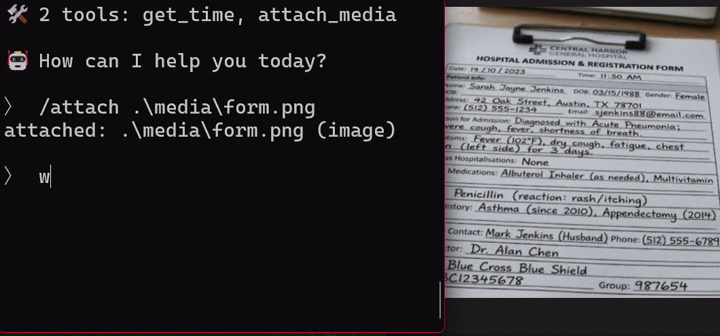

# litertlm-go

[](https://pkg.go.dev/github.com/vladimirvivien/litertlm-go)

A high-performance Go binding for Google's [LiteRT-LM](https://github.com/google-ai-edge/LiteRT-LM) runtime, designed for local on-device/edge LLM inference.

> Inspired by Hybridgroup's [Yzma](https://github.com/hybridgroup/yzma).

📖 **Full documentation:** [vladimirvivien.github.io/litertlm-go](https://vladimirvivien.github.io/litertlm-go/)

---

## 🔥 Features 

* 📦 **Automated Provisioning** — Automatically download, cache, and stage official LiteRT-LM prebuilts (`LibFetch`) and `.litertlm` models from Hugging Face (`FetchModel`) directly in Go.
* ⚙️ **Centralized Configuration** — Load engine and sampler configurations from a shared `config.json` profile file (`WithConfigFile`).
* 💬 **Stateful Chat & Conversations** — Multi-turn chat orchestration with system prompts, transcript seeding, KV cache management, and branching (`Chat.Clone`).
* 🖼️ **Multimodal Inputs** — Process text, image, and audio inputs in any order using a unified Go interface.
* 🛠️ **Automated Tool Calling** — Register Go functions as tools with automatic dispatch, streaming tool calls, and error recovery policies.
* 🎯 **Structured JSON Output** — Extract model outputs directly into Go structs with type-safe generic helpers (`GenerateData[T]`, `GenerateDataMulti[T]`).
* ⚡ **Hardware Acceleration** — Run on CPU, GPU (WebGPU/Direct3D 12/Metal), or NPU with multi-token speculative decoding.
* 🔍 **Low-Level Control** — Access the full LiteRT-LM C-API when you need custom inference loops, scoring, template introspection, or file-descriptor loading.

---

## Install

```bash
go get github.com/vladimirvivien/litertlm-go@latest
```

---

## Quickstart (with Automated Provisioning)

Here is how simple it is to get started with `litertlm-go`. Start by programmatically download LiteRT-LM libraries and model artifacts directly in your Go application:

```go
package main

import (
	"context"
	"fmt"
	"log"
	"runtime"

	"github.com/vladimirvivien/litertlm-go/pkg/litertlm"
)

func main() {
	ctx := context.Background()

	// 1. Fetch prebuilt shared libraries automatically (cached locally)
	libDir, err := litertlm.LibFetch(runtime.GOOS, runtime.GOARCH, "v0.16.0")
	if err != nil {
		log.Fatalf("LibFetch failed: %v", err)
	}

	// 2. Download model from Hugging Face automatically (cached locally)
	modelPath, err := litertlm.FetchModel(ctx, "litert-community/gemma3-1b-it-int4")
	if err != nil {
		log.Fatalf("FetchModel failed: %v", err)
	}

	// 3. Initialize client and generate text
	client, err := litertlm.New(ctx,
		litertlm.WithLib(libDir),
		litertlm.WithModel(modelPath),
	)
	if err != nil {
		log.Fatalf("Initialization failed: %v", err)
	}
	defer client.Close()

	text, err := client.Generate(ctx, "Write a short poem about coding in Go.")
	if err != nil {
		log.Fatalf("Generation failed: %v", err)
	}
	fmt.Println(text)
}
```

### Manual Provisioning

You can optionally run with pre-existing local libraries and model paths:

```bash
LITERTLM_LIB=/abs/path/to/dist/lib \
LITERTLM_MODEL=/abs/path/to/gemma3-1b-it-int4.litertlm \
    go run main.go
```

> To run on the GPU backend, configure initialization with `litertlm.WithBackend("gpu")` (defaults to `"cpu"`).

---

## Provisioning & Staging

* **Automated Provisioning (Go):** Use `litertlm.LibFetch` and `litertlm.FetchModel`.
* **Linux / macOS Manual Staging:** [`LITERTLM-BUILD.md`](./LITERTLM-BUILD.md)
* **Windows Manual Staging & DXC Setup:** [`LITERTLM-BUILD-WINDOWS.md`](./LITERTLM-BUILD-WINDOWS.md)

> [!NOTE]
> Minimum supported upstream C-API runtime: **LiteRT-LM v0.16.0**.

---

## Running Examples

Every example in `examples/` supports automated provisioning flags for zero-configuration execution:

```bash
# Automatically fetch dependencies and run
go run ./examples/hello -get-lib v0.16.0 -get-model litert-community/gemma3-1b-it-int4

# Multi-turn chat with a persistent bot:
go run ./examples/bot -get-lib v0.16.0 -get-model litert-community/gemma3-1b-it-int4

# Automated tool-calling with reflection:
go run ./examples/autotool -get-lib v0.16.0 -get-model litert-community/gemma3-1b-it-int4
```

See [`examples/README.md`](./examples/README.md) for the complete index of 37 runnable examples.

### Multimodal Demo

[`examples/bot`](./examples/bot) demonstrates multimodal capabilities (e.g. OCR and structured entity extraction from images):



---

## Documentation

* [Getting Started](https://vladimirvivien.github.io/litertlm-go/getting-started/) — Installation and provisioning workflows
* [Client Guide](https://vladimirvivien.github.io/litertlm-go/client/) — Client configuration, unary generation, and options
* [Chat Guide](https://vladimirvivien.github.io/litertlm-go/chat/) — Multi-turn dialogue, system prompts, and tool calling
* [Structured Output](https://vladimirvivien.github.io/litertlm-go/structured-output/) — JSON extraction via `GenerateData[T]`
* [Low-Level API](https://vladimirvivien.github.io/litertlm-go/low-level/) — Custom inference, scoring, and memory management
* [Supported Models](https://vladimirvivien.github.io/litertlm-go/docs/models.md) — Model support matrix and hardware accelerator backends
* [Troubleshooting](https://vladimirvivien.github.io/litertlm-go/troubleshooting/) — Debugging loader, memory, and acceleration issues

---

## License

Apache-2.0, matching upstream LiteRT-LM.
